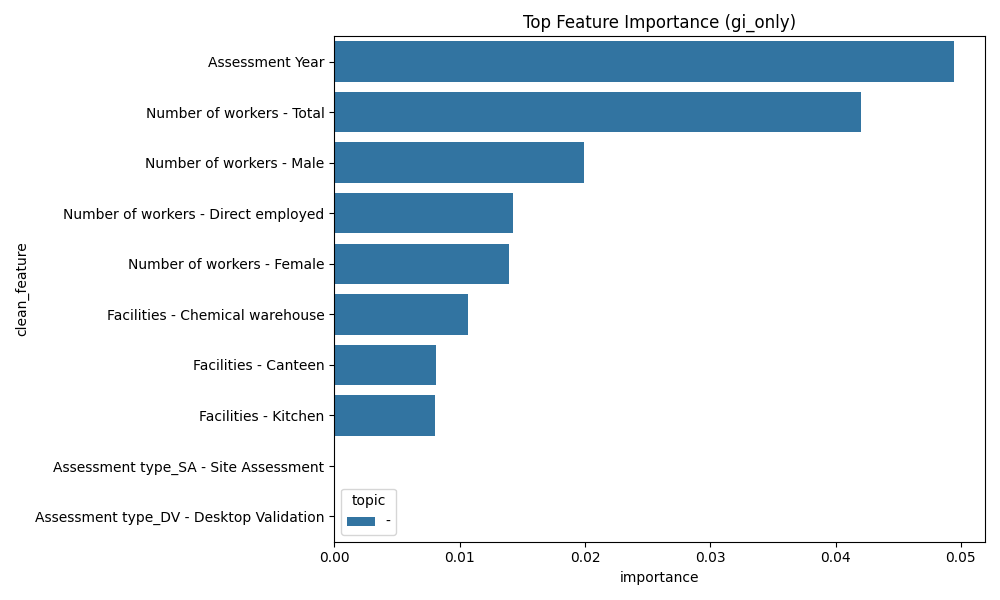
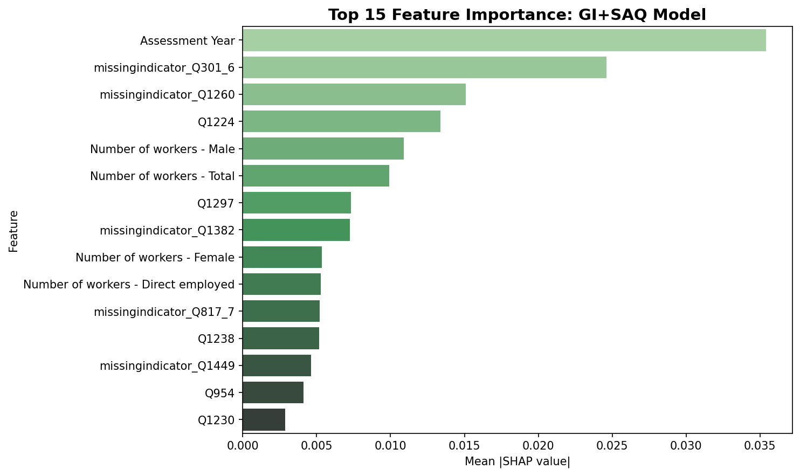
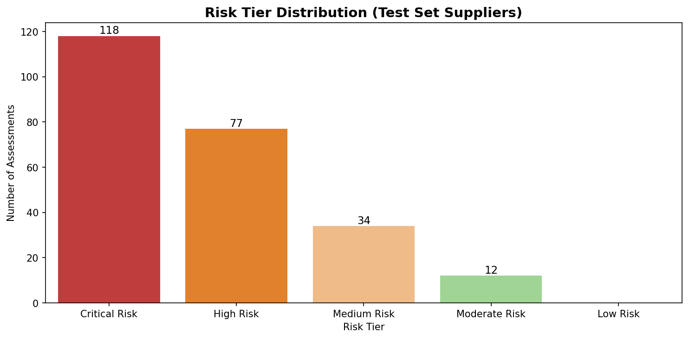
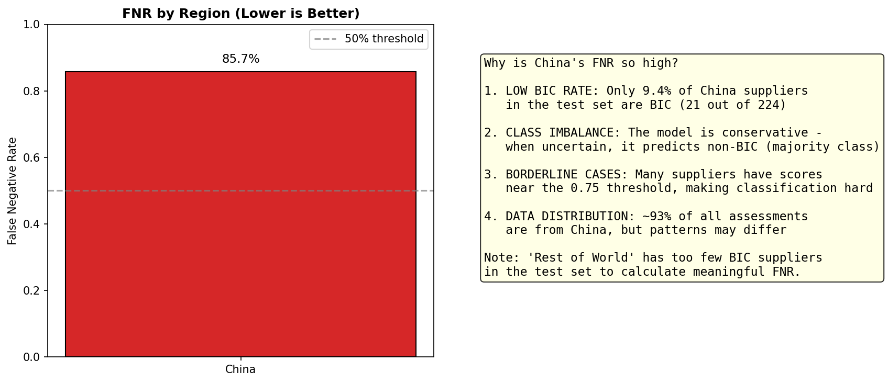

# Philips Supplier Sustainability Analytics Brief

Matias Cam, Armel Esper, Rutvi Gala, Krisztián Kerényi

Link to the GitHub repository : https://github.com/matiascam02/sustainability_coral

## Content

This brief provides a summary of the `starter_notebook.ipynb`, which contains the full process, code, and results. By running the notebook, you will be able to run our models and visualisations.

## Executive Summary
This analysis evaluates the effectiveness of General Information (GI) and Self-Assessment Questionnaire (SAQ) data in predicting supplier sustainability performance (`Val_Score`). Using a supplier-stratified validation approach, we found that augmenting GI data with SAQ responses significantly improves predictive power, nearly doubling the R² score and increasing AUC. We recommend a two-stage risk segmentation framework to prioritize interventions, while noting a potential fairness concern regarding higher false negative rates for suppliers in China.

## Methodology

**Data:** 1,236 assessments from 463 suppliers (2016-2025).

- The target variable is Val_Score (0 to 1). The best-in-Class threshold is 0.75. The average supplier sustainability score is 0.48, with half of all assessments scoring below 0.50. While the maximum observed score reaches 0.90, the concentration of scores in the 0.45-0.60 range suggests significant room for improvement across Philips' supplier base, particularly in reaching the 0.75 Best-in-Class benchmark.

- There are 31 GI features:
    - 3 categorical: Country, Assessment type, Assessment Year
    - 28 numerical: Activities, Facilities, Workforce metrics

- There are 450 SAQ features (all columns starting with "Q")

- GI features have relatively low missingness (most <1%), except for specialized activities (85%+) : Activities - Testing and measurement, Number of workers - Indirect employed, Activities - Surface treatment / plating, and Activities - Silkscreen / pad printing.

- Some SAQ features have extreme missingness (some >99%), likely because not all questions apply to all suppliers or suppliers skip questions.

- The dataset is cleaned by removing assessments without validated scores or country labels. 

**Validation:** We perform a stratified split by `Supplier ID` (80/20) to prevent data leakage.

**Feature Engineering Pipeline** : A pipeline handles missing data through median imputation for numeric features and mode imputation for categorical features. Features with >95% missing values were removed, retaining 31 GI features and 434 GI+SAQ features. One-hot encoding transforms categorical variables, and standardization ensures numeric features contribute equally to model training

**Models:** Random Forest Regressor (for scoring) and Classifier (for BIC identification).

**Feature Sets:**
    1.  **GI-only:** Publicly observable data (Activities, Facilities, Workforce).
    2.  **GI+SAQ:** GI data plus detailed questionnaire responses.

## Baseline Model

Baseline models establish performance benchmarks: the mean-prediction regression achieves RMSE=0.198 and MAE=0.164, while the majority-class classifier achieves 88.4% accuracy but only 0.5 ROC-AUC. The high baseline accuracy reflects class imbalance (only 12% of suppliers are Best-in-Class), making ROC-AUC the more meaningful metric for evaluating model performance. Our models must exceed these baselines.

## Results Comparison

The addition of SAQ data provides an increase in model performance, particularly for regression tasks (predicting the exact score).

Random Forest regression with GI+SAQ features achieves the best performance (RMSE=0.145, R²=0.445), explaining 44.5% of sustainability score variance, nearly double the GI-only model (R²=0.230). However, ridge regression fails with high-dimensional sparse data (R²=-3.71 for GI+SAQ). 

For classification, Random Forest with GI+SAQ achieves ROC-AUC=0.912 (82% above baseline), demonstrating great ranking ability, though with conservative predictions (precision=0.667, recall=0.061). 

Logistic Regression provides better balance (F1=0.444) for identifying Best-in-Class suppliers. The results confirm that self-assessment questionnaires enhance predictive power beyond observable characteristics alone.

Random Forest regression with GI+SAQ features achieves the best performance (RMSE=0.145, R²=0.445), explaining 44.5% of sustainability score variance, nearly double the GI-only model (R²=0.230). Ridge regression fails with high-dimensional sparse data (R²=-3.71 for GI+SAQ).

For classification, Random Forest with GI+SAQ achieves ROC-AUC=0.912 (82% above baseline), demonstrating great ranking ability, though with conservative predictions (precision=0.667, recall=0.061).

Logistic Regression provides better balance (F1=0.444) for identifying Best-in-Class suppliers. The results confirm that self-assessment questionnaires enhance predictive power beyond observable characteristics alone.

| Metric | GI-Only Model | GI + SAQ Model | Improvement |
| :--- | :--- | :--- | :--- |
| **RMSE** | 0.172 | **0.148** | -14% |
| **R²** | 0.218 | **0.420** | +93% |
| **AUC** | 0.761 | **0.870** | +14% |
| **Accuracy** | 89.4% | 89.4% | 0% |

> [!NOTE]
> While accuracy remains stable (likely due to class imbalance), the AUC score demonstrates that the GI+SAQ model is significantly better at ranking suppliers and distinguishing Best-in-Class (BIC) performers.

## Feature Importance & Interpretation

### GI-Only Drivers

The most influential GI features relate to the assessment context and workforce scale.

- **Assessment Year:** Strongest driver, likely reflecting rising sustainability standards over time.
- **Workforce Size (Total/Male):** Larger workforce counts correlate with score variance, possibly indicating that larger suppliers face more scrutiny or have more resources for compliance.

SHAP analysis of the GI-only Random Forest model reveals that workforce size and assessment year are the dominant predictors of sustainability scores, followed by gender composition and employment type.

Country is not among the top 10 drivers despite China representing 90% of the dataset, indicating that within-country supplier variation exceeds between-country differences. The concentration of importance in workforce metrics highlights the limited predictive power of observable characteristics alone.

SHAP analysis of the GI-only Random Forest model reveals that workforce size and assessment year are the dominant predictors of sustainability scores, followed by gender composition and employment type.

Country is not among the top 10 drivers despite China representing 90% of the dataset, indicating that within-country supplier variation exceeds between-country differences. The concentration of importance in workforce metrics highlights the limited predictive power of observable characteristics alone.

### GI + SAQ Drivers

When SAQ data is available, specific questionnaire responses become the primary predictors.

SHAP analysis of the GI+SAQ Random Forest model reveals that assessment year remains the dominant predictor, followed by missing data indicators for questions Q301_6, Q1260, and Q1382 (0.007-0.025), demonstrating that non-response patterns are highly informative signals of sustainability risk. 

Only two actual questionnaire responses appear in the top 10: Q1224 (Environmental Procedures, 0.013) and Q1297 (Health & Safety Implementation, 0.007), highlighting the importance of documented processes and execution. 

Workforce metrics remain important but with 31-78% reduced impact compared to the GI-only model, confirming that questionnaire responses provide superior signal to observable characteristics. The shift from facility-based proxies (canteen, chemical warehouse) to direct practice questions validates the value of self-assessment data.

## Risk Segmentation Framework

We propose a 5-tier risk segmentation based on the predicted `Val_Score` to guide procurement actions.

| Risk Tier | Score Range | Recommended Action |
| :--- | :--- | :--- |
| **Critical Risk** | < 0.50 | **Immediate Audit:** High priority for on-site assessment and corrective action plans. |
| **High Risk** | 0.50 - 0.60 | **Targeted Review:** Request specific documentation for weak areas; schedule audit if unsatisfactory. |
| **Medium Risk** | 0.60 - 0.70 | **Desktop Review:** Monitor via SAQ updates; verify improvements in next cycle. |
| **Moderate Risk** | 0.70 - 0.80 | **Maintain:** Standard monitoring cadence. |
| **Low Risk** | ≥ 0.80 | **Reward/Partner:** Consider for "Best-in-Class" recognition and strategic partnership. |

The risk segmentation framework classifies 49% of test suppliers as Critical Risk (predicted score <0.50) and 32% as High Risk (0.50-0.59), indicating that 81% of the held-out supplier base requires immediate intervention. Only 5% achieve Moderate Risk status (0.70-0.79), with zero suppliers predicted to reach Low Risk (≥0.80). This bottom-heavy distribution suggests systemic sustainability challenges across the supplier base.

## Fairness Analysis

We evaluated the model for geographic bias by comparing the False Negative Rate (FNR) – the rate at which actual BIC suppliers are incorrectly classified as non-BIC.

> [!WARNING]
> **Potential Bias Detected:** The model shows a high False Negative Rate for suppliers in China (~86%). This means high-performing Chinese suppliers are frequently underestimated by the model.

| Region | Total Assessments | BIC Suppliers | BIC Rate |
|--------|------------------|---------------|----------|
| China | 1,172 | 93 | 7.9% |
| Rest of World | 90 | 4 | 4.4% |

> **Mitigation:** Manual review is recommended for Chinese suppliers near the BIC threshold (e.g., predicted score 0.70-0.75) to avoid missing potential BIC candidates.

## Recommendations

1. **Adopt GI+SAQ Model:** The GI+SAQ Random Forest model achieves 93% better explanatory power (R²=0.445 vs 0.230) and 18% higher classification accuracy (ROC-AUC=0.912 vs 0.774) compared to GI-only models, demonstrating that the operational effort of collecting self-assessment questionnaire data delivers predictive value. This model should become the primary tool for supplier sustainability assessment and risk segmentation.

2. **Focus on Implementation Questions:** SHAP analysis identifies Q1224 (Environmental Procedures) and Q1297 (Health & Safety Implementation) as the most predictive questionnaire responses, suggesting that documented processes and actual execution matter more than high-level policies. We suggest to prioritize validation of these specific questions during on-site audits, and to consider developing targeted supplier training programs around procedural documentation and implementation practices.

3. **Address Regional Bias:** The model exhibits an 85.7% False Negative Rate for Chinese suppliers, systematically underestimating 18 of 21 Best-in-Class suppliers in the test set and creating unfair disadvantages in recognition and partnership opportunities.

4. **Leverage Non-Response Patterns:** Missing data indicators for questions Q301_6, Q1260, and Q1382 rank among the top 8 most important features, revealing that which questions suppliers refuse to answer is as predictive as their actual responses. We suggest investigating the content of these high-impact questions to understand why non-response correlates with poor sustainability performance, make them mandatory fields in future assessments, and flag suppliers with low questionnaire completion rates (<80%) for immediate follow-up as transparency gaps can signal elevated risk.

## Summary 

Philips’ supplier sustainability performance can be predicted more accurately when combining General Information (GI) data with Self‑Assessment Questionnaire (SAQ) responses, nearly doubling model explanatory power and significantly improving AUC. SAQ data, including both specific responses and non‑response patterns, emerges as the strongest indicator of sustainability risk, enabling a five‑tier risk segmentation that highlights widespread underperformance across suppliers. A fairness check reveals that the model systematically underestimates high‑performing Chinese suppliers, prompting a recommendation for targeted manual review.
